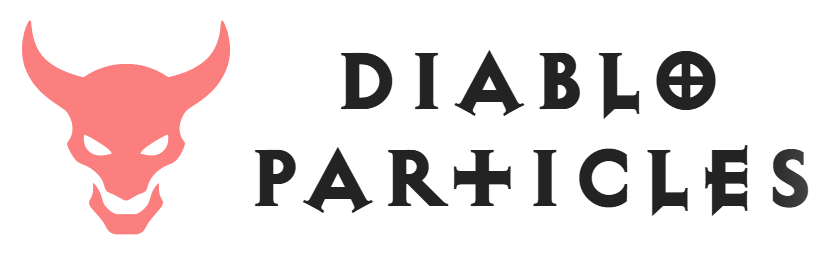

# Diablo Particles

  

A streamlined GPUParticles3D node for creating dynamic billboard particle effects using UV panning and texture multiplication.

## 🎬 Technique

This plugin is based on the GDC Talk: The VFX of Diablo. Watch the recording of this talk to understand the technique.

## ✨ Features

### Inspector Integration
- **Real-time Texture Previews**: See your textures and panning effects in the inspector with RGB and alpha previews

### Core Parameters
- **Extends GPUParticles3D**: Leverages the node's built-in performance and features
  - **ParticleProcessMaterial**: All of the features are supported - except flipbook animation which is instead used for random UV offsets
- **Blending Modes**: 
  - **Mix**: Standard alpha blending for e.g., smoke
  - **Additive**: Additive blending for emissive effects
  - **Premultiplied Alpha**: Hybrid mix/additive blending, referred to as BlendAdd in The VFX of Diablo
  - **Debug**: Untextured transparent quad preview
  - **Custom**: Coming soon
- **Texture Animation**: Combine up to 4 different textures with independent UV scaling and panning
  - Enabling panning will also randomly offset U or V per particle.
- **Color & Alpha Boost**: Compensate for brightness loss from texture multiplication
